# Initial setup
This initial lesson will cover how to setup our environment for Python programming, we will be using the following programs:
- Anaconda
- Jupyter Notebooks
- Google Collab (online)
- VSCode
- Git (and Github)

Requirements: 
- Working knowledge of computers, comfortable installing new software.
- No previous programming knowledge is required.

All installations from this section forward were made in a Windows 10 installation. Some installation instructions for macOS will be provided, but they will not be covered during recordings.

## Step 1. Installing Miniconda
Conda (or Miniconda in this case) is an open-source package management system and environment management that runs on Windows, macOS, and Linux. It can help you manage and install Python packages.

Miniconda is the smaller version of Anaconda that includes only conda, Python and a small number of packages. For these lessons we will be using Miniconda. To install:
- Go to [Conda User Guide](https://docs.conda.io/projects/continuumio-conda/en/latest/user-guide/install/index.html).
- Download your appropiate installer for Miniconda from the Regular installation section and run the installer.
- Follow the setup wizard. Leave the "Advanced Options" as default. Click on "Install".
- Once installed you can search your system for "Anaconda Prompt (miniconda3)". Open this app.

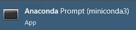

- From here you can directly run Python 3 code using the `python` command

Running Python

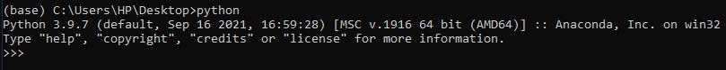

- If your installation is correct you should be able to run a simple command like `1 + 1` or `print("Hello from miniconda")` we will take a look at this commands during the lessons. If your output is similar to the next image you are ready for the next steps.

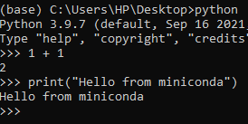

To exit simply type `exit()` or press Control + Z and then Enter.

## Step 2. Installing Jupyter Notebook
By now you may have noticed that the miniconda prompt shows the word `(base)` at the beginning, this is the current Python environment you are in. Environments do the following:
- Isolating different environments with different dependencies and packages.
This is useful when you have different projects with different versions of packages. This includes different versions of Python.

Lets create an environment and install Jupyter Notebooks:
- Open your miniconda3 prompt.
- Run `conda create -n myenv python` this will create a new environment called "myenv".
- Press `y` and enter when prompted. This will install the necessary packages.
- Once all packages are installed, activate your environment with `conda activate myenv`. You should now see `(myenv)` at the beggining of your prompt instead of `(base)`.
- Lets install Jupyter Notebooks on your newly created environment by running `conda install jupyter`.
- Once installation is completed you can run `jupyter notebook` from your enviroment where you just installed Jupyter.
- You can now verify jupyter installation by running `conda list` from your environment and finding the jupyter package.
- If you ever need to uninstall a package you can run `conda uninstall packagename` where package name is the name of the package you want to uninstall. Remember you can always run `conda list` to list packages installed in your enviroment or `conda list -n enviromentname` to list a specific enviroment installed packages, where "enviromentname" is the name of the enviroment you want to see packages for.

## Step 3. Running Jupyter Notebook
- Open your miniconda3 prompt.
- Navigate to your Desktop by using the `cd` command. In my case I type `cd Desktop` press Enter. 
- Activate the environment where you installed Jupyter Notebooks.
- (Optional) Create a new directory to have all your notebooks in using the `mkdir` command. Example: `mkdir Jupyter`, this creates a new folder called "Jupyter" on my current directory. Enter your newly created folder with `cd`, in my case `cd Jupyter`
- Run Jupyter Notebooks with `jupyter notebook`
- You should now see a window like this one on your browser. From here you can create new notebooks and run jupyter notebooks.

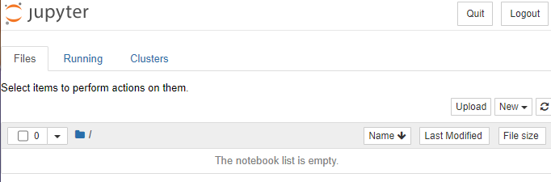

- Lets create a new notebook. Click on New -> Notebook: Python 3 (ipykernel).

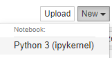

- Click on File -> Save as... and give a name to your notebook.

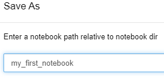

- From this window you can create new code cells, run code cells and add markdown syntax.
- Add a simple `print("Hello from Jupyter")` in the first cell

- Run the cell with 
- You should now see your code output below the cell. In jupyter each code cell can have its own output.

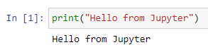

- Congratulations. You can now run Jupyter Notebooks. When you are finished you can just close the Jupyter tab from your browser.

## Step 4. Running Jupyter Notebooks from Google Colaboratory.
Google Colab is Google's online version of Jupyter Notebooks. It provides ease of access to coding with Python and other advanced features such as using GPUs to run your code.

Requirements for this section:
- A Google account.

- Go to you Google Drive at [Drive](drive.google.com). Log in to your preferred account.
- (Optional) Create a new folder to run your notebooks from.
- From the top of the page click on New

- Go to More -> Connect more apps

- From the search bar type "Colaboratory". The following result will show up.

- Click on Install and grant permissions.
- Click on Done and go back to your Drive. If you click on New, you should now see the  option. Click on it to create a new notebook.
- You can change the name of your notebook from the top section, rename your notebook to something else.

- Similar to Jupyter Notebook, you can run Python code and create new code cells. Run a simple `print("Hello from Google Colab!")` and run the code using the Run button.

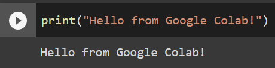

- Congratulations you have just installed Google Colab on your Drive and ran your fist Python code!

## Step 5. Installing a code editor
Code editors allow us to write and format code in different programming languages, as well as extra features such as syntaxis, code completion, some code editors go beyond this adding debugging and even Git support for version control. On this tutorial we will use VSCode for a short example, but feel free to use your preferred editor if you have one, some popular ones:
- [Sublime Text](http://www.sublimetext.com/)
- [Atom](https://atom.io/)

We will be using [VSCode](https://code.visualstudio.com/)
- Download and install VSCode
- From the File menu open a Folder. File -> Open Folder... open the Jupyter folder we created on a previous step, or create a new folder to store your new files.
- If asked about "Do your trust the authors?" click "Yes".
- Once installed, open your VSCode application and click on "New File".

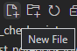

- Lets create a Python file. Name your new file as `hello.py`, don't forget about the ".py" extension at the end. This lets our computer know this is a Python file.
- Lets add some basic code. Add a simple `print` statement such as `print("Hello from a Python file")`
- Eventually we could run Python code directly in the VSCode terminal, but for this lesson we will be using miniconda3. Open your miniconda3 terminal.
- Navigate to the folder where you created your `.py` file. Remember you can use the `cd` command to navigate between folders.

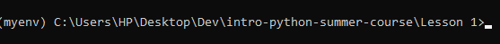

- Now that we are in the correct folder, where our `.py` file is, we can run `python hello.py` to use the Python interpreter from Anaconda. You should see the text output from the Python file.

- Congratulations, you now know how to create simple `.py` files as well as `.ipynb` with Jupyter Notebooks, each has its uses as we will see in the next lessons

## Step 6. Installing Git
When collaborating with others, tools like version control are incredibly useful, code often breaks and people make mistakes, and it's really useful to have a tracking system where we can revert changes and go back to previous versions.

Git is a free and open version control system. It makes use of the branching model, which allows you to work on different versions of your code, and to publish and share only the ones you know are ready. We will use Git and Github (an online version control system) to learn how to interact with code repositories and keep different versions of our code.

- Create a [Github](https://github.com/) account.
- Download the correct Git version from [this link](https://git-scm.com/downloads)
- Run the installer and if you are on Windows, make sure to check:
    - [x] Windows Explorer Integration
    - [x] Git Bash Here
    - [x] Git GUI Here
You can leave other installation components as default. Click on Next and select "Use Visual Studio Code as Git's default editor". Leave all other options as default.
- You should now see Git Bash and Git Gui in your program list.

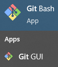

- You should also see the Git Bash and Git GUI options when you right click from the File Explorer.
- We will cover how Git and Github work together during the first lesson.