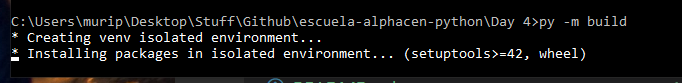
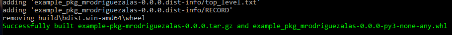
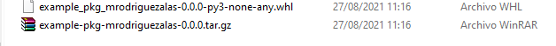
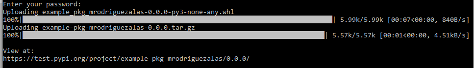
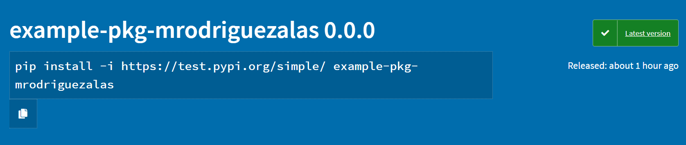

# Lesson 8 - Publishing code to Python Package Index
In this lesson we will be looking how to publish a test package to PyPI or the Python Package Index. PyPI is a repository for Python software.

The first step is to create a folder and file structure as the following. Whenever you see a "/" at the end of the name it means this is a folder.

1. Create the following folder and file structure:

```
tutorial_package/
└── src/
    └── example_package/
        ├── __init__.py
        └── example.py

```
2. Make sure `__init__.py` is empty. This is necessary to import our package and should be empty for this tutorial.
3. Add your code to the file `example.py`, this is where we will place our functions for the tutorial package. Add your functions and logic inside this file. For this example I will keep it pretty simple, but you can (and should) add more complex functions. If you still don't have an example you can use the following code:

```
def add_one(number):
    return number + 1
```

4. Create a new file called `LICENSE` for our package license and add the following text:

```
Copyright (c) 2018 The Python Packaging Authority

Permission is hereby granted, free of charge, to any person obtaining a copy
of this software and associated documentation files (the "Software"), to deal
in the Software without restriction, including without limitation the rights
to use, copy, modify, merge, publish, distribute, sublicense, and/or sell
copies of the Software, and to permit persons to whom the Software is
furnished to do so, subject to the following conditions:

The above copyright notice and this permission notice shall be included in all
copies or substantial portions of the Software.

THE SOFTWARE IS PROVIDED "AS IS", WITHOUT WARRANTY OF ANY KIND, EXPRESS OR
IMPLIED, INCLUDING BUT NOT LIMITED TO THE WARRANTIES OF MERCHANTABILITY,
FITNESS FOR A PARTICULAR PURPOSE AND NONINFRINGEMENT. IN NO EVENT SHALL THE
AUTHORS OR COPYRIGHT HOLDERS BE LIABLE FOR ANY CLAIM, DAMAGES OR OTHER
LIABILITY, WHETHER IN AN ACTION OF CONTRACT, TORT OR OTHERWISE, ARISING FROM,
OUT OF OR IN CONNECTION WITH THE SOFTWARE OR THE USE OR OTHER DEALINGS IN THE
SOFTWARE.
```

5. Create a file `pyproject.toml`.
6. Create a file named `README.md`.
7. Create a file named `setup.cfg`.
8. Create an empty `tests/` folder. The resulting structure will look like the following:

```
packaging_tutorial/
├── LICENSE
├── pyproject.toml
├── README.md
├── setup.cfg
├── src/
│   └── example_package/
│       ├── __init__.py
│       └── example.py
└── tests/
```

9. Inside `pyproject.toml` add the following:
```
[build-system]
requires = [
    "setuptools>=42",
    "wheel"
]
build-backend = "setuptools.build_meta"
```

`[build-system]` will provide us with a list of dependencies for our package during the build phace. `build-backend` is the object that will actually build the project.

10. Fill out the file named `setup.cfg` with **your** information. Placeholder text is provided, you need to fill out your username/name, version, author, author_email, description, and Github URL if you have one. Also if your package has dependencies on other packages such as Pandas, Numpy, etc you will need to fill out the `install_requires` section with the package name (and version, if relevant). Our example package looks like this, fill out the following information:
```
[metadata]
name = example-pkg-YOUR_USERNAME_GOES_HERE
version = 0.0.1
author = YOUR NAME
author_email = YOUR EMAIL
description = A short description for your package
long_description = file: README.md 
long_description_content_type = text/markdown
url = URL TO THE PACKAGE GITHUB IF YOU HAVE ONE
classifiers = 
    Programming Language :: Python :: 3
    License :: OSI Approved :: MIT License
    Operating System :: OS Independent

[options]
package_dir =
    = src
packages = find:
python_requires = >=3.6

[options.packages.find]
where = src
```

**NOTE**: If your package has dependencies on other packages, you need to specify the package names inside the `install_requires` definition. If your package does not depende on any other packages, use the previous `setup.cfg`. Here is an example for dependencies of Numpy, Pandas and Astropy:
```
[metadata]
name = example-pkg-YOUR_USERNAME_GOES_HERE
version = 0.0.1
author = YOUR NAME
author_email = YOUR EMAIL
description = A short description for your package
long_description = file: README.md 
long_description_content_type = text/markdown
url = URL TO THE PACKAGE GITHUB IF YOU HAVE ONE
classifiers = 
    Programming Language :: Python :: 3
    License :: OSI Approved :: MIT License
    Operating System :: OS Independent

[options]
package_dir =
    = src
packages = find:
python_requires = >=3.6
install_requires =
    numpy
    pandas
    astropy

[options.packages.find]
where = s
```

11. Fill out the README.md of your package. This contains more information about the package, author, a longer description, functions, etc. This file should contain a more in depth description of what your package should do and how to use it.
    
## Creating a build
1. Install the latest `build` version with `pip install --upgrade build`
2. Run, from Windows `py -m build`, from Unix/macOS `python3 -m build` from the directory where your `pyproject.toml` is located. This command will create two files that will be sent to PyPI.

Package build:



Build Success:



Resulting build files:



1. Create a free account in [PyPI](https://test.pypi.org/account/register/). Save your username and password as you will need it for the next steps.
2. Install Twine, from Windows: `py -m pip install --upgrade twine` or from mac/Unix:`python3 -m pip install --upgrade twine`
3. Upload the package to the test repository with `py -m twine upload --repository testpypi dist/*`. Enter your username and password created in the previous step.
4. If done correctly you should now have your package published to the test PyPI repository.



Copy the URL from the previous image, you can paste this in your browser and see your published package. You could also share this link for someone else to install it with `pip`.



As a final note, you can use the [Github Markdown Documentation](https://docs.github.com/es/get-started/writing-on-github/getting-started-with-writing-and-formatting-on-github/basic-writing-and-formatting-syntax) to format your markdown files.